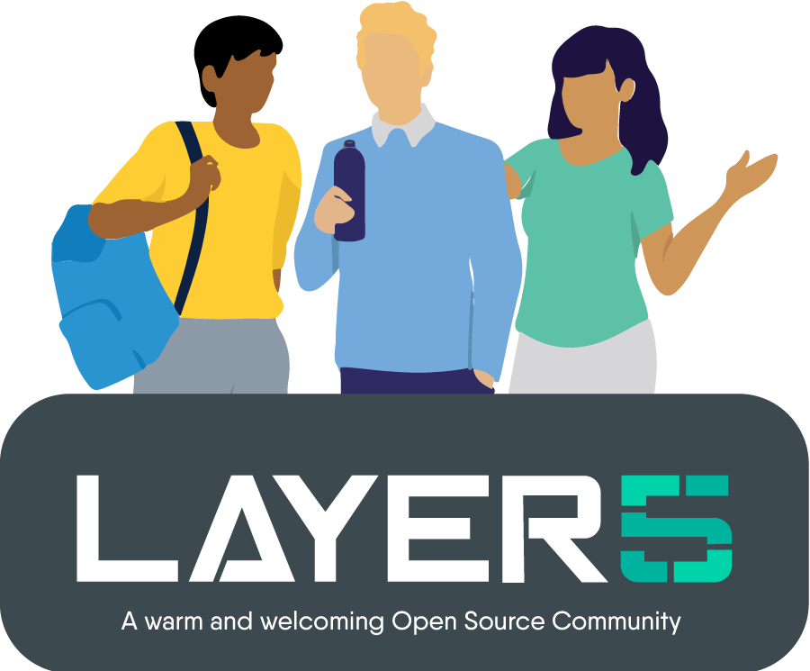

<p style="text-align:center;" align="center">
  </p>

<div align="center">


[](http://slack.layer5.io)


</div>

# Layer5 Istio Adapter

## Deploying the adapter to a Kubernetes cluster with Istio
Deploy the adapter itself and its service:
```
kubectl -n istio-system apply k8s.yaml
```
Now navigate into the `testdata` folder:
```
cd testdata
```
Apply the attributes and template yaml:
```
kubectl -n istio-system apply -f attributes.yaml -f template.yaml
```
Now lets apply the layer5 adater definition:
```
kubectl -n istio-system apply -f layer5.yaml
```
Finally, lets deploy the operator config:
```
kubectl -n istio-system apply -f sample_operator_cfg_cluster.yaml
```

## Setup dev environment
```
mkdir -p $GOPATH/src/istio.io/ && \
cd $GOPATH/src/istio.io/  && \
git clone https://github.com/istio/istio
```

```
export MIXER_REPO=$GOPATH/src/istio.io/istio/mixer

export ISTIO=$GOPATH/src/istio.io
```

```
cd $MIXER_REPO/adapter
git clone https://github.com/layer5io/layer5-istio-adapter layer5
cd layer5
```

To build:
```
make build
```

To run locally:
```
make run
```

To run mixer server locally:
```
make mixs
```

To run mixer client:
```
make mixc
```

If you make changes to the proto file, then we have to generate the associated Go code:
```
make gen
```

## Join the Community!

<a name="contributing"></a><a name="community"></a>
Our projects are community-built and welcome collaboration. 👍 Be sure to see the <a href="https://docs.google.com/document/d/17OPtDE_rdnPQxmk2Kauhm3GwXF1R5dZ3Cj8qZLKdo5E/edit">Layer5 Community Welcome Guide</a> for a tour of resources available to you and jump into our <a href="http://slack.layer5.io">Slack</a>!

<p style="clear:both;">
<a href ="https://layer5.io/community/meshmates"></a>
<h3>Find your MeshMate</h3>

<p>MeshMates are experienced Layer5 community members, who will help you learn your way around, discover live projects and expand your community network. 
Become a <b>Meshtee</b> today!</p>

Find out more on the <a href="https://layer5.io/community">Layer5 community</a>. <br />
<br /><br /><br /><br />
</p>

<div>&nbsp;</div>

<a href="https://slack.meshery.io">

<picture align="right">
  <source media="(prefers-color-scheme: dark)" srcset=".github/readme/images//slack-dark-128.png"  width="110px" align="right" style="margin-left:10px;margin-top:10px;">
  <source media="(prefers-color-scheme: light)" srcset=".github/readme/images//slack-128.png" width="110px" align="right" style="margin-left:10px;padding-top:5px;">
  
</picture>
</a>

<a href="https://meshery.io/community"></a>

<p>
✔️ <em><strong>Join</strong></em> any or all of the weekly meetings on <a href="https://calendar.google.com/calendar/b/1?cid=bGF5ZXI1LmlvX2VoMmFhOWRwZjFnNDBlbHZvYzc2MmpucGhzQGdyb3VwLmNhbGVuZGFyLmdvb2dsZS5jb20">community calendar</a>.<br />
✔️ <em><strong>Watch</strong></em> community <a href="https://www.youtube.com/playlist?list=PL3A-A6hPO2IMPPqVjuzgqNU5xwnFFn3n0">meeting recordings</a>.<br />
✔️ <em><strong>Access</strong></em> the <a href="https://drive.google.com/drive/u/4/folders/0ABH8aabN4WAKUk9PVA">Community Drive</a> by completing a community <a href="https://layer5.io/newcomer">Member Form</a>.<br />
✔️ <em><strong>Discuss</strong></em> in the <a href="https://discuss.layer5.io">Community Forum</a>.<br />
</p>
<p align="center">
<i>Not sure where to start?</i> Grab an open issue with the <a href="https://github.com/issues?q=is%3Aopen+is%3Aissue+archived%3Afalse+org%3Alayer5io+org%3Ameshery+org%3Aservice-mesh-performance+org%3Aservice-mesh-patterns+label%3A%22help+wanted%22+">help-wanted label</a>.
</p>

### About

[Layer5](https://layer5.io)'s cloud native application and infrastructure management software enables organizations to expect more from their infrastructure. We embrace developer-defined infrastructure. We empower engineer to change how they write applications, support operators in rethinking how they run modern infrastructure and enable product owners to regain full control over their product portfolio.

#### License

This repository and site are available as open source under the terms of the [Apache 2.0 License](https://opensource.org/licenses/Apache-2.0).
